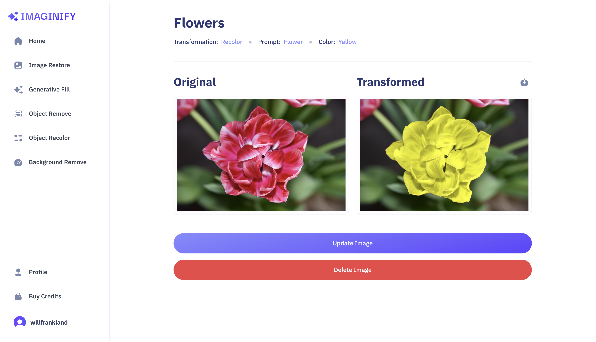

## About this app

This SaaS app utilizes Cloudinary AI which allows users to modify images in a variety of ways. They can remove items from images, manipulate image colours, generate fill and restore old images.

It was built using NextJs, TypeScript, TailwindCSS, Cloudinary, Clerk, ShadCN and Stripe to handle payments.

Users are able to save and download their images and the site runs on a credit system where payments for more credits are handled by Stripe.

### Functionality & Key Features

The site is fully adjustable for screen sizes ranging from mobile to desktop.

I followed a tutorial created by JavaScriptMastery to become more proficient with TypeScript and NextJs, learn more key principles and best practices in order to expand my portfolio.

The PixelWhiz app has been deployed on Vercel can be viewed here:

https://pixelwhiz-aa3t-fuodhwd1y-willfranklands-projects.vercel.app

## Tech Stack

- NextJs
- TypeScript
- TailwindCSS
- ShadCN
- Clerk
- Cloudinary
- MongoDB
- HTML
- CSS

## Screenshots

# Getting Started

## Available Scripts

In the project directory, you can run:

### `npm  i`
### `npm  run dev`

Runs the app in the development mode.\
Open [http://localhost:3000](http://localhost:3000) to view it in your browser.

The page will reload when you make changes.\